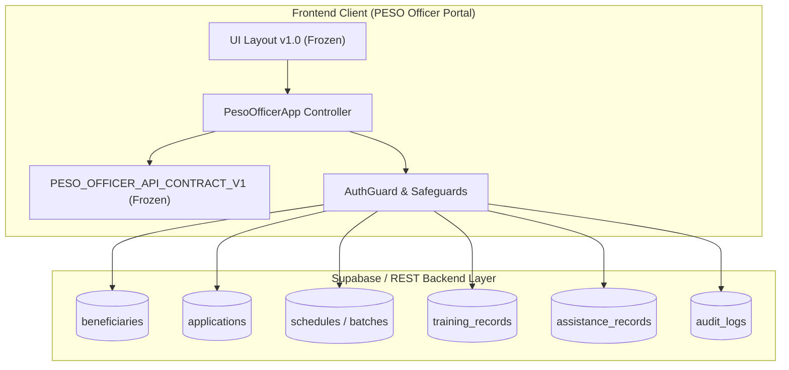

# PESO Officer Portal: UI Layout & API Contract v1.0 (Frozen Specification)

**Project**: City Government of Koronadal — Public Employment Service Office (PESO)  
**Contract Version**: `1.0.0-FROZEN`  
**Status**: `LOCKED / IMMUTABLE`  
**Effective Date**: `August 30, 2026`  
**Compliance**: Data Privacy Act of 2012 (RA 10173), LGU Koronadal City Executive Policy, WCAG 2.1 AA  

---

## 1. System Architecture & Role Boundaries



### 1.1 Role-Based Access Control (RBAC) Governance Matrix
| Operation Category | PESO Officer (Portal User) | PESO Admin | Beneficiary | Governance Rule |
| :--- | :--- | :--- | :--- | :--- |
| **Beneficiary Intake / Walk-in** | **Allowed** (Create & Update) | Read-only / Approval | Self-registration | *Rule 2 / Rule 5* |
| **Beneficiary Profile Edit** | **Allowed** (Officer-managed) | **Blocked** (Admin cannot edit direct details) | Restricted | *Module Rule 1* |
| **Beneficiary Assignment** | **Allowed** (Cohort & Program allocation) | Read-only / Audit | Read-only | *Rule 2* |
| **Details Modals** | **Strictly Read-Only** | **Strictly Read-Only** | **Strictly Read-Only** | *User Global Rule 1* |
| **System CRUD (Programs, Budgets)** | **Blocked** (View only) | **Full CRUD Allowed** | Blocked | *User Global Rule 2* |
| **Application Evaluation** | **Completeness Check & Resubmission** | Final Approval Level 3 | View status & resubmit | *Evaluation Specs* |
| **Slot Scheduling** | **Batch Assignment Only** | Slot Creation & Approval | View scheduled dates | *Scheduling Specs* |
| **Training Attendance** | **Mark Attendance & Progress** | Auto-pull Certificate Eligibility | View certificate | *Scheduling Rule 4* |
| **Assistance Disbursement** | **QR Scan & Verification** | Budget Allocation | Dual Receipt Confirmation | *Disbursement Specs* |
| **Audit Logging** | **Mandatory Immutable Logging** | **Mandatory Immutable Logging** | Non-logging | *User Global Rule 3* |

---

## 2. Frozen UI Layout Specifications

### 2.1 Design Tokens & Palette
- **Primary Accent**: `#F19FB9` (Signature Rosy Blush)
- **Antique Rose / Brand Secondary**: `#C87D87`
- **Surface (Light Mode)**: `#FFFFFF` / App Background `#FAF8F6`
- **Surface (Dark Mode)**: `#131B2A` / `#171F2E` / App Background `#0B0F17`
- **Text (Light Mode)**: `#2B2526` (Muted: `#64748B`)
- **Text (Dark Mode)**: `#F8FAFC` (Muted: `#94A3B8`, Contrast >= 5.8:1)
- **Adaptive Close Buttons**: `.btn-close-theme-adaptive` with circular backdrop & hover transitions

### 2.2 Breakpoints & Layout Constraints
- **Desktop (>= 992px)**: Sidebar width `270px`, main content margin `280px`, header height `70px`.
- **Tablet (< 992px)**: Collapsible offcanvas sidebar, main content padding `90px 16px 30px 16px`.
- **Mobile (<= 768px)**: Strict 1-column / 2-column adaptive flow, horizontal scroll prevention on body (`overflow-x: hidden !important; width: 100% !important; max-width: 100% !important;`).
- **Data Tables**: Wrapped in `.table-responsive` with touch momentum scrolling.

### 2.3 10 Standard Module Layouts
1. **Dashboard Tab (`#tab-dashboard`)**: 8 KPI Lifecycle Stat Cards, Priority Action Queue, Upcoming Schedules.
2. **Beneficiaries Tab (`#tab-beneficiaries`)**: Filter bar, search input, responsive data table, Walk-in modal, View-Only Record modal, 2-column Edit modal.
3. **Application Evaluation Tab (`#tab-evaluations`)**: Completeness check, Approve action, Deny with mandatory reason & 3-day (72hr) resubmission deadline.
4. **Beneficiary Batches Tab (`#tab-batches`)**: Candidate batching, batch status pills, lock batch mechanism.
5. **Scheduling Tab (`#tab-scheduling`)**: Calendar & list views, batch-to-slot assignment, conflict validation, past date blocking.
6. **Training Attendance Tab (`#tab-trainings`)**: Attendance tracking, status badges (In Progress / Completed), sync with certificate auto-pull.
7. **Funds & Resources Tab (`#tab-funds`)**: Resource allocation, item ledger, voucher tracking.
8. **Disbursement Release Tab (`#tab-distribution`)**: QR Code Scanner modal, dual voucher confirmation, inventory deduction.
9. **Notification Hub Tab (`#tab-notifications`)**: Stream updates, cohort broadcast sender.
10. **Report Engine Tab (`#tab-reports`)**: Read-only datasets, CSV exporter, printable PDF generator.

---

## 3. Frozen API Contract v1.0

### 3.1 Data Privacy & Phone Masking Contract
- **Contract Rule**: All contact numbers transmitted in list/read payloads must be sanitized or masked using standard format: `09XX-***-XXXX`.
- **Masking Algorithm**:
  ```javascript
  function maskContactNumber(phone) {
      if (!phone || phone === 'N/A' || phone === '-') return '09XX-***-XXXX';
      const clean = String(phone).replace(/\D/g, '');
      if (clean.length >= 10) {
          return `${clean.substring(0, 4)}-***-${clean.substring(clean.length - 4)}`;
      }
      return '09XX-***-XXXX';
  }
  ```

### 3.2 Endpoint Schemas & Payloads

#### A. Beneficiary Update (`PUT /rest/v1/beneficiaries?id=eq.{id}`)
```json
{
  "first_name": "string (min 2 chars)",
  "middle_name": "string (optional)",
  "last_name": "string (min 2 chars)",
  "suffix": "string (optional)",
  "date_of_birth": "YYYY-MM-DD",
  "age": "integer (>= 15)",
  "sex": "Male | Female | Other",
  "civil_status": "Single | Married | Widowed | Separated | Divorced",
  "barangay": "string (valid Koronadal barangay)",
  "purok": "string (optional)",
  "contact_number": "09XXXXXXXXX",
  "email": "string (valid email format)",
  "educational_attainment": "string",
  "employment_status": "string",
  "skills": "string[] | string",
  "is_pwd": "boolean",
  "is_4ps": "boolean",
  "is_senior": "boolean",
  "is_solo_parent": "boolean",
  "is_ip": "boolean",
  "updated_at": "ISO8601 string"
}
```

#### B. Application Completeness Evaluation (`POST /rest/v1/applications/evaluate`)
```json
{
  "application_id": "string",
  "action": "approve | deny | flag",
  "officer_remarks": "string (mandatory min 10 chars for flag/deny)",
  "resubmission_deadline": "ISO8601 string (now + 72 hours if flagged)",
  "evaluated_by": "string (officer username)",
  "evaluated_at": "ISO8601 string"
}
```

#### C. Schedule Batch Assignment (`POST /rest/v1/schedules/assign-batch`)
```json
{
  "schedule_slot_id": "string",
  "batch_id": "string",
  "activity_type": "Interview | Training | Distribution",
  "assigned_date": "YYYY-MM-DD (must be >= current date)",
  "start_time": "HH:MM:SS",
  "end_time": "HH:MM:SS (must be > start_time)",
  "conflict_checked": true,
  "assigned_by": "string (officer username)",
  "assigned_at": "ISO8601 string"
}
```

#### D. Assistance Release & Dual Confirmation (`POST /rest/v1/assistance_records/release`)
```json
{
  "qr_pass_id": "string (QR-BEN-XXXX)",
  "application_id": "string",
  "program_id": "string",
  "grant_amount": "number (PHP)",
  "voucher_ref": "string (VOUCH-KOR-YYYY-XXXX)",
  "dual_confirmation": {
    "officer_confirmed": true,
    "beneficiary_confirmed": true,
    "confirmation_timestamp": "ISO8601 string"
  },
  "disbursed_by": "string (officer username)",
  "created_at": "ISO8601 string"
}
```

#### E. Immutable Audit Log Entry (`POST /rest/v1/audit_logs`)
```json
{
  "action": "CREATE | UPDATE | ASSIGN | EVALUATE | RELEASE | CANCEL",
  "details": "string (human readable audit explanation)",
  "entity_type": "officer_action",
  "target_id": "string (optional)",
  "officer_name": "string",
  "created_at": "ISO8601 string"
}
```

---

## 4. Immutability & Conformance Guarantee
- The API Contract and UI Layout definitions are frozen under `PESO_OFFICER_API_CONTRACT_V1` and sealed with `Object.freeze()`.
- Future iterations extending the contract must create a new version namespace (`v1.1` or `v2.0`) without breaking backward compatibility of `v1.0`.
